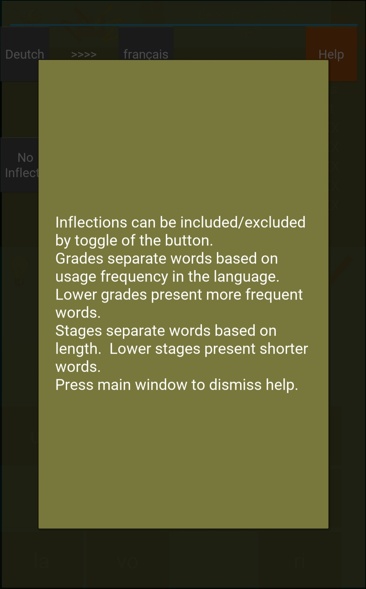

# TransGrub

A multi-platform bilingual word spelling game for Android, iOS, Linux, macOS and Windows.

Compose word in the chosen quiz language based on clues given in the chosen clue language.  Currently, 9 languages are supported as clue language and 5 are for quiz language.  Difficulty levels are defined with 3 grades and 5 stages - lower grade includes more frequently used words, while lower stage has shorter words.

This is an experiment project based on Python and Kivy.  The words are generated with the help from project Word2Word (https://github.com/kakaobrain/word2word).

This software is released under the GPLv3 license (https://www.gnu.org/licenses/gpl-3.0.en.html)

A fully functional Android apk file is included in the releases.

 
 
 
